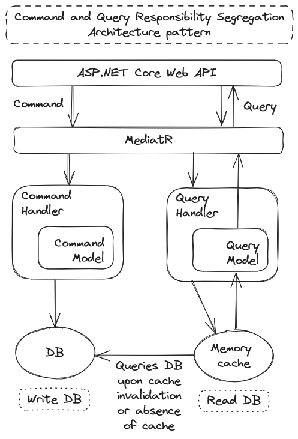

# Project architecture

The project architecture adheres to the CQRS (Command Query Responsibility 
Segregation) pattern. CQRS separates the concerns of reading data (queries) 
from writing data (commands), enabling the optimization of each operation 
independently. This architectural approach enhances scalability, performance, 
and maintainability by allowing different models and data stores for reads 
and writes. Commands represent actions that modify the system state, while 
queries retrieve data for presentation purposes. By decoupling these 
responsibilities, the system can better handle complex domain logic and 
evolving business requirements. CQRS promotes a clearer separation of 
concerns, facilitating easier testing, debugging, and optimization of 
both read and write operations.