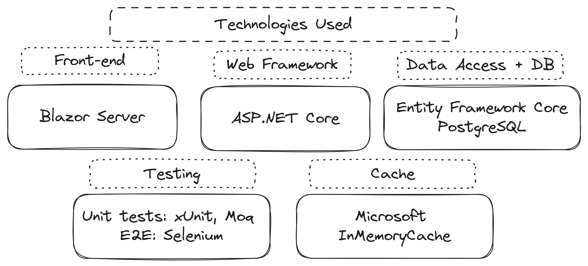

# Used technologies

My4Notes project utilizes a robust tech stack to deliver a seamless user experience. 

**Blazor Server and HTMX:**
 - Both provide tooling for creating dynamic, interactive UIs without relying on complex JavaScript frameworks
 - Blazor Server simplifies development with a unified .NET codebase
 - HTMX enables dynamic updates through simple HTML attributes, leading to faster load times and smoother user interactions

**ASP.NET Core Web API:**
 - Offers robust tools for building RESTful APIs, ensuring efficient data exchange between client and server. 
 - Provides a modular and extensible architecture, allowing for easy integration with various components.

**Database and ORM:**
 - Entity Framework Core simplifies database interactions with its object-relational mapping (ORM) capabilities, offering flexibility in choosing the right database provider for you use-case.
 - PostgreSQL, as an open-source, production-ready, and feature-rich database management system, is a viable choice for a wide range of applications.

**Cache:**

Despite, Redis been a more mature and feature-rich in-memory storage solution, Microsoft InMemoryCache has several adventages:

 - Higher performance
 - Interoperability with the .NET ecosystem
 - Lower latency, as it is located in the application server

**Testing:**
 - xUnit and Moq both used for unit testing purposes, where xUnit provides simple and flexible unit testing framework and Moq primarily used for creating mock objects in unit tests
 - Selenium is an open-source automation testing framework primarily used for E2E testing.